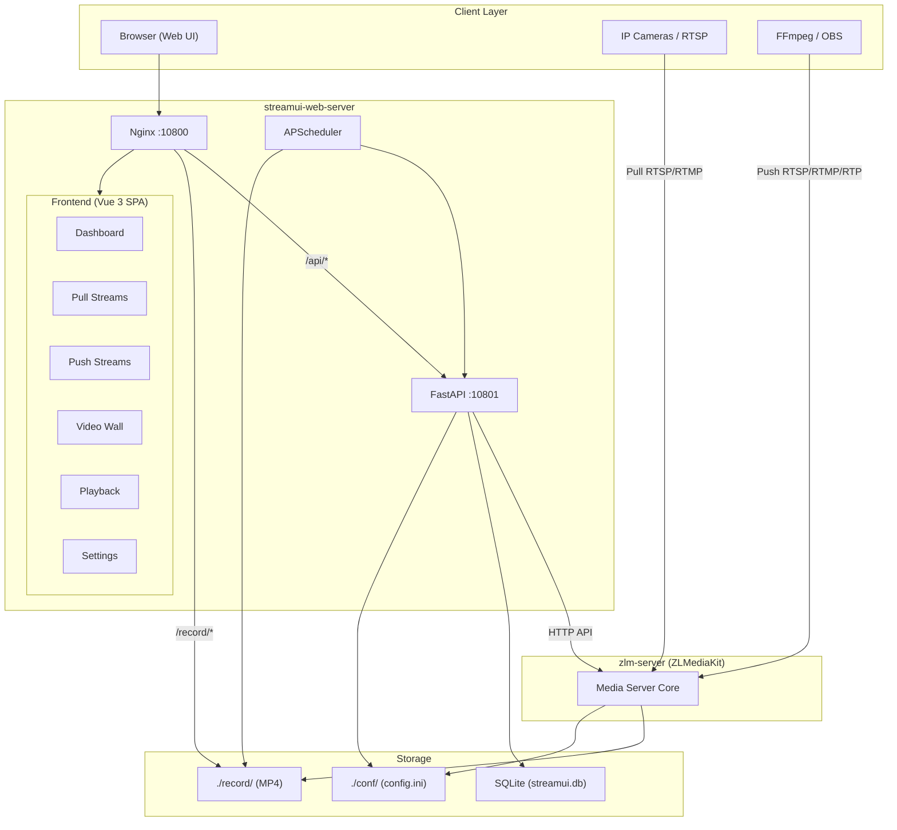
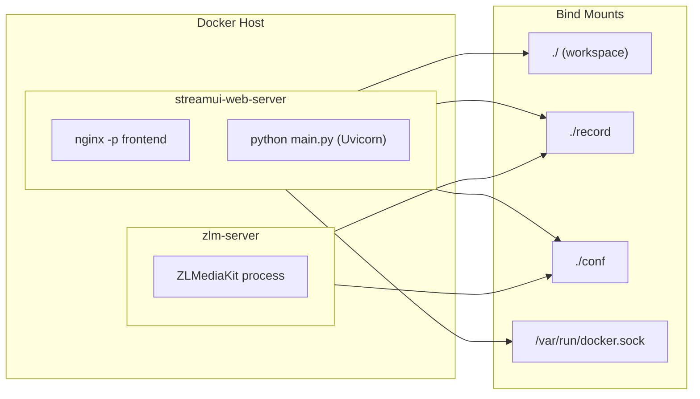
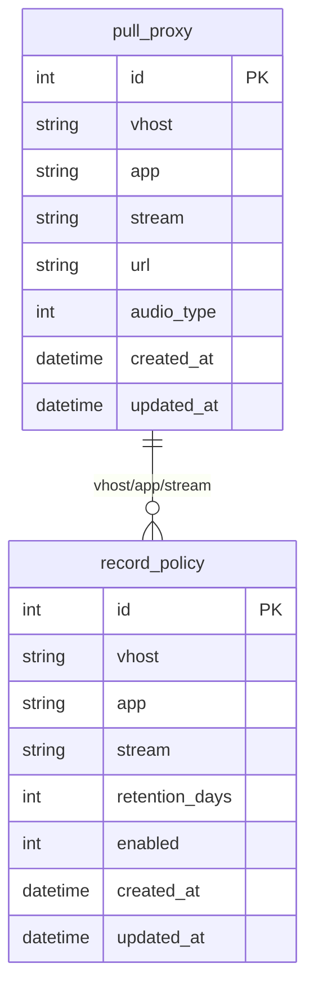

# Mini NVR System Architecture

A minimal, self-hosted Network Video Recorder built on ZLMediaKit. This document describes the system architecture, components, and data flows.

---

## High-Level Overview

```
┌─────────────────────────────────────────────────────────────────────────────────┐
│                              CLIENT LAYER                                        │
│  ┌──────────────┐  ┌──────────────┐  ┌──────────────┐  ┌──────────────────────┐ │
│  │   Browser    │  │  IP Cameras  │  │   FFmpeg    │  │  OBS / Other Sources │ │
│  │  (Web UI)    │  │  (RTSP/RTMP) │  │  (Push)     │  │  (RTSP/RTMP/RTP)     │ │
│  └──────┬───────┘  └──────┬───────┘  └──────┬───────┘  └──────────┬───────────┘ │
└─────────┼─────────────────┼─────────────────┼────────────────────┼─────────────┘
          │                 │                 │                    │
          │ :10800          │ :8554/:1935     │ :8554/:1935/:10000  │
          │                 │                 │                    │
┌─────────▼─────────────────▼─────────────────▼────────────────────▼─────────────┐
│                           APPLICATION LAYER                                      │
│  ┌─────────────────────────────────────────────────────────────────────────┐   │
│  │                    streamui-web-server (host network)                     │   │
│  │  ┌─────────────┐  ┌─────────────────┐  ┌──────────────────────────────┐  │   │
│  │  │   Nginx     │  │  FastAPI        │  │  APScheduler                 │  │   │
│  │  │   :10800    │  │  (Uvicorn)      │  │  • Hourly: cleanup old MP4    │  │   │
│  │  │             │  │  :10801         │  │  • 30s: auto-resume recording │  │   │
│  │  │ • Static    │  │                 │  └──────────────────────────────┘  │   │
│  │  │ • /record/  │  │  • REST API     │                                      │   │
│  │  │ • /api/ →   │  │  • ZLM proxy    │                                      │   │
│  │  │   backend   │  │  • SQLite CRUD  │                                      │   │
│  │  └─────────────┘  └────────┬────────┘                                      │   │
│  └────────────────────────────┼──────────────────────────────────────────────┘   │
│                               │                                                   │
│  ┌────────────────────────────▼──────────────────────────────────────────────┐   │
│  │                         zlm-server (ZLMediaKit)                            │   │
│  │  RTMP :1935 │ HTTP :8080 │ HTTPS :8443 │ RTSP :8554 │ RTP :10000          │   │
│  │  WebRTC :8000/:9000 (UDP)                                                  │   │
│  │  • Ingest: pull proxy, push streams                                        │   │
│  │  • Distribution: FLV, HLS, fMP4, WebRTC                                    │   │
│  │  • Recording: MP4 segments → ./record/                                    │   │
│  └───────────────────────────────────────────────────────────────────────────┘   │
└─────────────────────────────────────────────────────────────────────────────────┘
          │
┌─────────▼───────────────────────────────────────────────────────────────────────┐
│                           STORAGE LAYER                                          │
│  ┌─────────────────┐  ┌─────────────────┐  ┌─────────────────┐                     │
│  │  SQLite         │  │  ./record/      │  │  ./conf/        │                     │
│  │  streamui.db    │  │  MP4 segments   │  │  config.ini     │                     │
│  │  • pull_proxy   │  │  app/stream/    │  │  ZLM settings   │                     │
│  │  • record_policy│  │  YYYY-MM-DD/    │  │                 │                     │
│  └─────────────────┘  └─────────────────┘  └─────────────────┘                     │
└───────────────────────────────────────────────────────────────────────────────────┘
```

---

## Component Diagram (Mermaid)



---

## Request Flow

### 1. Web UI Access

```
Browser → Nginx (:10800) → Static files (index.html, Vue, CSS, JS)
                         → /api/* → FastAPI (:10801)
                         → /record/* → Direct MP4 file serving
```

### 2. Pull Stream (Add RTSP Camera)

```
User clicks Add → Frontend POST /api/stream/pull-proxy
    → FastAPI writes to SQLite (pull_proxy table)
    → FastAPI calls ZLM addStreamProxy API
    → ZLM connects to source URL, ingests stream
    → Stream available at rtsp://host:8554/app/stream
```

### 3. Recording Flow

```
User enables recording → Frontend GET /api/playback/start-record
    → FastAPI writes record_policy to SQLite
    → FastAPI calls ZLM startRecord API
    → ZLM writes MP4 segments to ./record/app/stream/YYYY-MM-DD/
    → APScheduler (30s) auto-resumes if recording stops
    → APScheduler (hourly) deletes segments older than retention
```

### 4. Playback Flow

```
User selects stream + date → Frontend GET /api/playback/streamid-record
    → FastAPI lists MP4 segments from ./record/
    → Frontend loads segments via /record/... (Nginx)
    → Timeline player seeks by segment
```

---

## Deployment Architecture



- **streamui-web-server**: `network_mode: host` — shares host network, accesses ZLM at `127.0.0.1:8080`
- **zlm-server**: Standard bridge networking with port mappings
- **start.sh**: Launches Nginx (foreground) and Uvicorn in parallel; `wait -n` keeps container alive

---

## Port Reference

| Port   | Protocol | Service / Purpose                          |
|--------|----------|---------------------------------------------|
| 10800  | TCP      | StreamUI frontend (Nginx)                   |
| 10801  | TCP      | StreamUI backend (FastAPI)                  |
| 1935   | TCP      | RTMP ingest / playback                      |
| 8080   | TCP      | ZLM HTTP — FLV, HLS, TS, fMP4, WebRTC API   |
| 8443   | TCP      | ZLM HTTPS / WSS                             |
| 8554   | TCP      | RTSP ingest / playback                      |
| 10000  | TCP+UDP  | RTP / RTCP                                  |
| 8000   | UDP      | WebRTC ICE / STUN                           |
| 9000   | UDP      | WebRTC auxiliary                            |

---

## Data Model



---

## Tech Stack Summary

| Layer      | Technology        | Role                                      |
|------------|-------------------|-------------------------------------------|
| Media      | ZLMediaKit        | Stream ingest, distribution, recording     |
| Backend    | FastAPI + Uvicorn | REST API, ZLM proxy, scheduler             |
| Frontend   | Vue 3 (CDN)       | SPA, hash routing, no build step           |
| Web Server | Nginx             | Static files, reverse proxy, MP4 serving  |
| Database   | SQLite            | pull_proxy, record_policy                  |
| Scheduler  | APScheduler       | Cleanup, auto-resume recording             |
| Runtime    | Docker Compose    | Containerised deployment                  |

---

## Stream Distribution URLs (when online)

| Protocol   | URL pattern                                      |
|------------|--------------------------------------------------|
| RTSP       | `rtsp://host:8554/app/stream`                    |
| RTMP       | `rtmp://host:1935/app/stream`                    |
| HLS (mpegts)| `http://host:8080/app/stream/hls.m3u8`          |
| HLS (fMP4) | `http://host:8080/app/stream/hls.fmp4.m3u8`     |
| HTTP-fMP4  | `http://host:8080/app/stream.live.mp4`          |
| WebRTC     | Via `/index/api/webrtc?app=...&stream=...`      |
